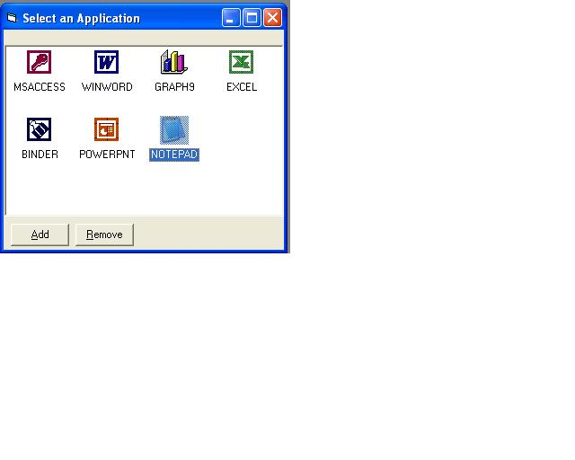



## Listview Example \- Application Runner

### Description

(Many of you may have seen this app before, I have made an enhancement - Its saves it to a file)

This is just another example of a listview control. With this example, you select an application, it copies its icon and places a shortcut in the listview control. Now, when you double click on this icon, it will launch the application.

Please vote on this application for me.

Enjoy....
 
### More Info
 

             |
---                |---
**Submitted On**   |2003-08-22 10:50:32
**By**             |[Santa's Little Helper](https://github.com/Planet-Source-Code/PSCIndex/blob/master/ByAuthor/santa-s-little-helper.md)
**Level**          |Intermediate
**User Rating**    |5.0 (15 globes from 3 users)
**Compatibility**  |VB 6\.0
**Category**       |[Complete Applications](https://github.com/Planet-Source-Code/PSCIndex/blob/master/ByCategory/complete-applications__1-27.md)
**World**          |[Visual Basic](https://github.com/Planet-Source-Code/PSCIndex/blob/master/ByWorld/visual-basic.md)
**Archive File**   |[Listview\_E1646459172003\.zip](https://github.com/Planet-Source-Code/santa-s-little-helper-listview-example-application-runner__1-48579/archive/master.zip)

